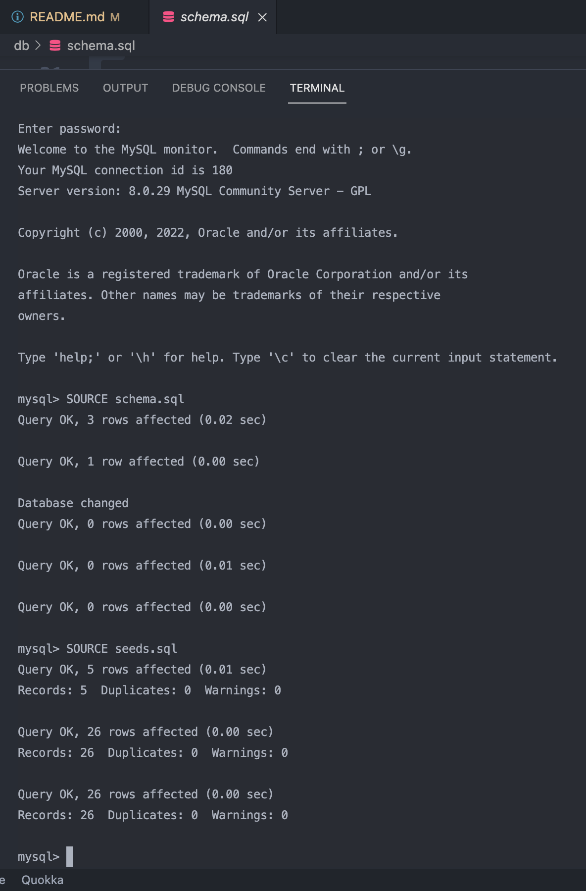
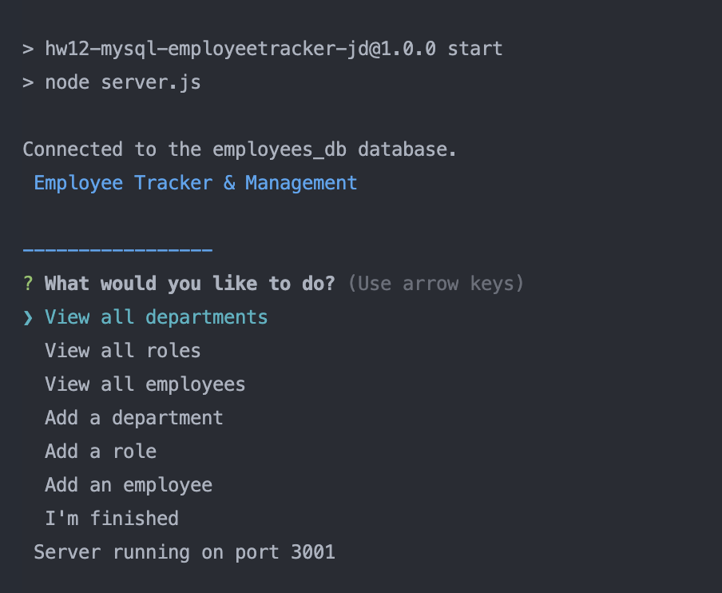
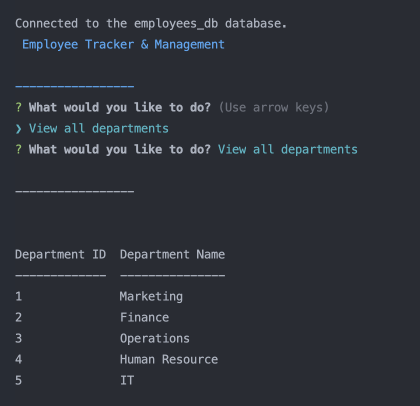
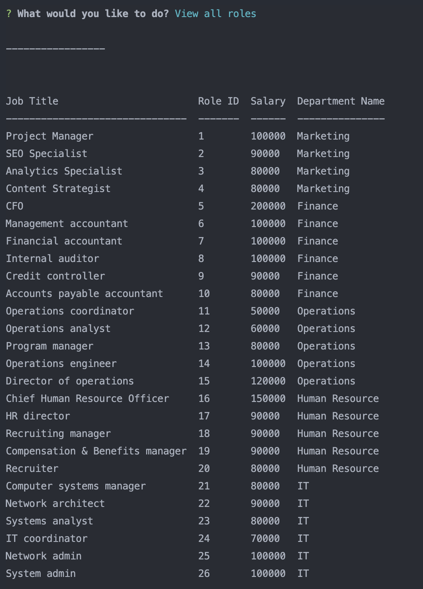
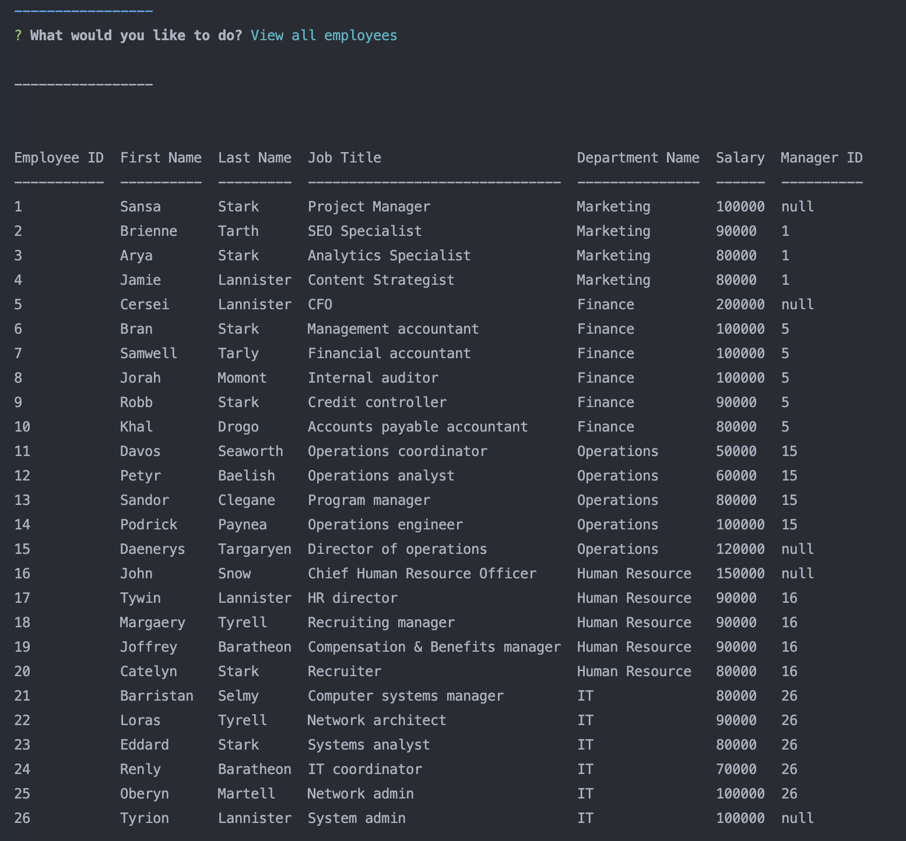
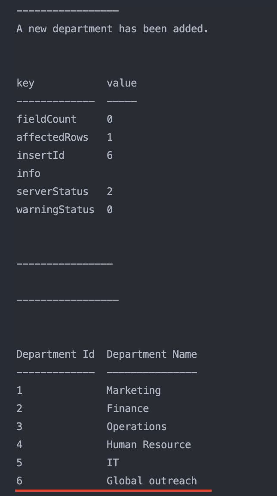
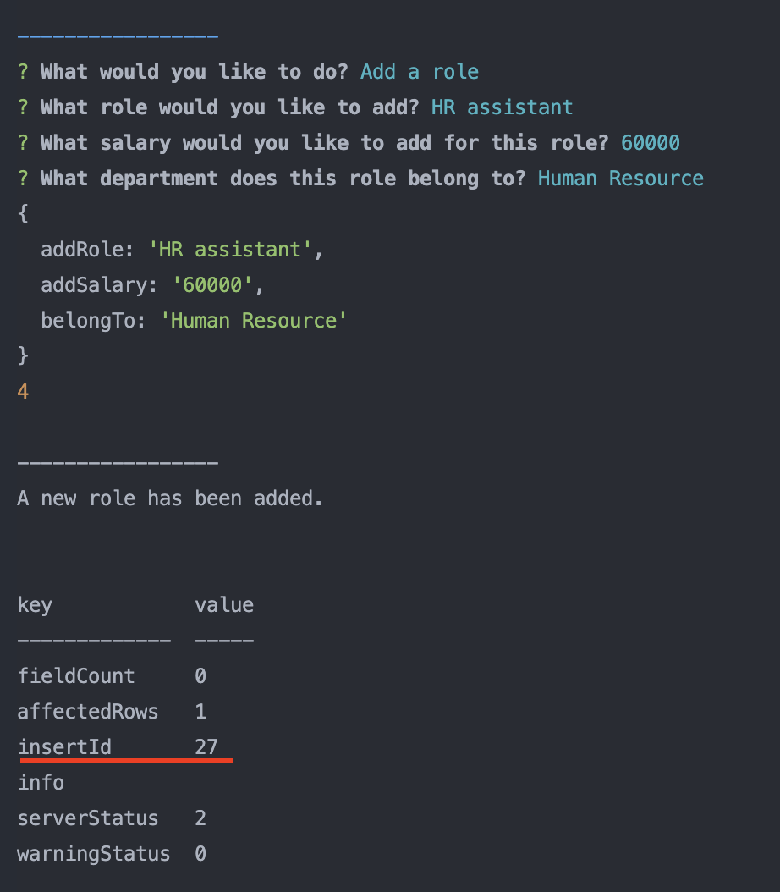
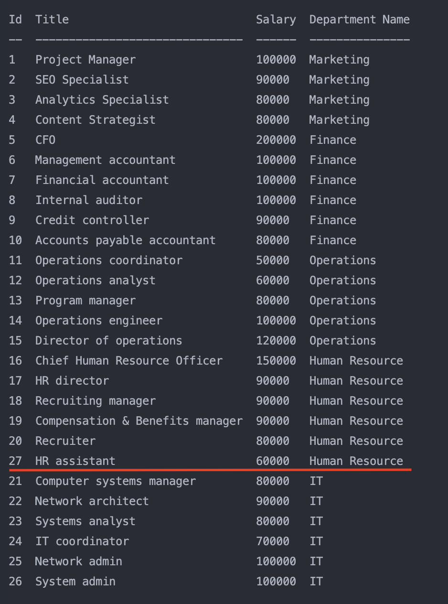
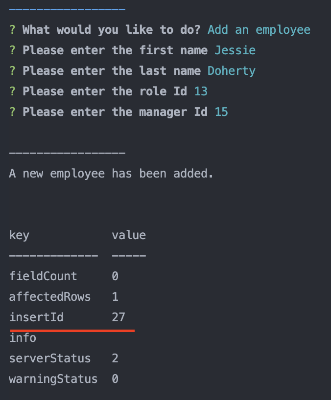
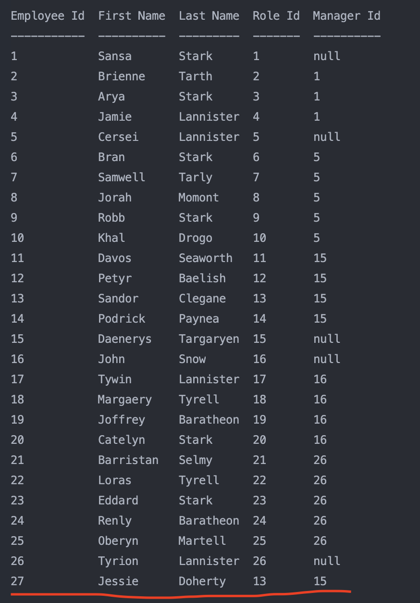

# hw12-MySQL-EmployeeTracker-JD

## Employee Tracker & Management

Designed by: Jessie Doherty

## Description

This is a command line app that can help you track the departments, roles, and employees in a company, as well as add a department, role or employee when managing the employee database.

- What was your motivation?
- Answer: A convenient way for HR department tracking the status of an organization's employees.
- Why did you build this project?
- Answer: Make a manager's life a bit easier.
- What problem does it solve?
- Answer: Tracking and managing employees.
- What did you learn?
- Answer: Node.js, Express.js, Console.table, Inquirer pakcage, MySQL queries, etc.

## Installation

Please tell us the 3 simple steps for installing your app.

- Step 1: Go to VS code and open the project folder.
- Step 2: Get into MySQL shell and SOURCE schema.sql and seeds.sql, then go to the main folder and run npm start.
- Step 3: Answer the prompted questions to show departments, roles and employees, or add department/role/employee. When done, chose "I'm finished" to quit the app.

## Usage

Screenshots of the App:

- Source the SQL database:
  

- Opening page of the app:
  

- View all departments:
  

- View all roles:
  

- View all employees:
  

- Add a department:
  

- Add a role:
  
  

- Add an employee:
  
  

## License

    MIT License

    Copyright (c) 2022 Jessie Doherty

    Permission is hereby granted, free of charge, to any person obtaining a copy
    of this software and associated documentation files (the "Software"), to deal
    in the Software without restriction, including without limitation the rights
    to use, copy, modify, merge, publish, distribute, sublicense, and/or sell
    copies of the Software, and to permit persons to whom the Software is
    furnished to do so, subject to the following conditions:

    The above copyright notice and this permission notice shall be included in all
    copies or substantial portions of the Software.

    THE SOFTWARE IS PROVIDED "AS IS", WITHOUT WARRANTY OF ANY KIND, EXPRESS OR
    IMPLIED, INCLUDING BUT NOT LIMITED TO THE WARRANTIES OF MERCHANTABILITY,
    FITNESS FOR A PARTICULAR PURPOSE AND NONINFRINGEMENT. IN NO EVENT SHALL THE
    AUTHORS OR COPYRIGHT HOLDERS BE LIABLE FOR ANY CLAIM, DAMAGES OR OTHER
    LIABILITY, WHETHER IN AN ACTION OF CONTRACT, TORT OR OTHERWISE, ARISING FROM,
    OUT OF OR IN CONNECTION WITH THE SOFTWARE OR THE USE OR OTHER DEALINGS IN THE
    SOFTWARE.

    ---

## 🏆 Miscellaneous

## Badges

## Features

- Tracking and adding employees/roles/departments.

## How to Contribute

- This repo is open to the public on my GitHub page.

## Demo URL

Please feel free to take a look at the demo video of this app:

[Demo link](https://drive.google.com/file/d/1bwDz9oy3K5kloQO3Kg-RRWWryj6zVLbq/view)
